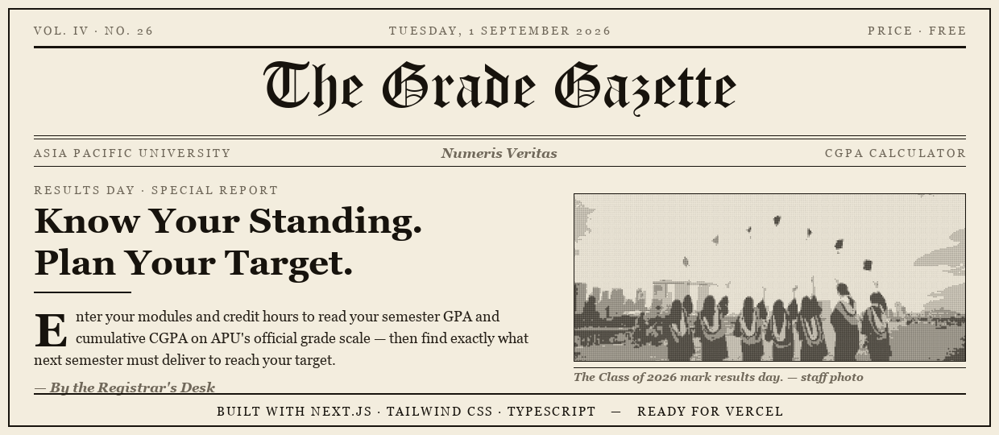

<div align="center">



# APU CGPA Calculator · *The Grade Gazette*

**A CGPA calculator and grade planner for Asia Pacific University (APU) students, set like a black-and-white broadsheet newspaper.**
Work out your semester GPA and cumulative CGPA — then turn to the Forecast Desk to find exactly what you need next semester to hit your target.

<br>

[](https://muhammadhasnain1-debug.github.io/apu-cgpa-calculator/)
[](https://vercel.com/new/clone?repository-url=https://github.com/MuhammadHasnain1-debug/apu-cgpa-calculator)


</div>

---

## ✨ What it does

- **CGPA calculator** — add your modules (credit hours + grade) and get your **semester GPA** and **cumulative CGPA** live, on APU's real grading scale.
- **"What do I need next semester?" planner** — enter your current CGPA, credits done, next-semester credits and a target CGPA. It tells you the **average GPA you'd need**, whether it's **achievable or out of reach**, the rough **grade in every module**, and your **best possible CGPA**.
- **Honest by the numbers** — if a target is mathematically impossible with the credits you have left, it says so (and shows the ceiling) instead of pretending.
- **Standing at a glance** — an indicative honours class (First Class, Second Upper, …) for your current CGPA.
- **Private & instant** — 100% client-side, **no database, no sign-in**. Your grades never leave the browser; entries are remembered via `localStorage`.
- **Newspaper styling** — a blackletter masthead, halftone photo and a print-press animation when you switch between the *Results Desk* and *Forecast Desk*, with a **Day / Night edition** toggle. Fully responsive and `prefers-reduced-motion` aware.

---

## 🎓 APU grading scale

| Grade | Marks | Point | | Grade | Marks | Point |
|:---:|:---:|:---:|---|:---:|:---:|:---:|
| A+ | 80–100 | 4.00 | | C- | 50–54 | 2.00 |
| A  | 75–79  | 3.70 | | D  | 40–49 | 1.70 |
| B+ | 70–74  | 3.30 | | F+ | 30–39 | 1.30 |
| B  | 65–69  | 3.00 | | F  | 20–29 | 1.00 |
| C+ | 60–64  | 2.70 | | F- | 1–19  | 0.00 |
| C  | 55–59  | 2.30 | | | | |

CGPA is the **credit-weighted** average of grade points: `Σ(credit × point) ÷ Σ(credit)`. C− (2.0) and above is a module pass.

---

## 🧮 How the planner works

To end a target CGPA `T` after `n` more credits, on top of a current CGPA `C` earned over `d` credits, the average you need next semester is:

```
required = ( T·(d + n) − C·d ) ÷ n
```

If `required > 4.0` the target is out of reach; the tool then shows the best CGPA you *can* reach — `(C·d + 4·n) ÷ (d + n)` — so you can set a realistic goal.

---

## 🛠️ Built with

- **Next.js 16** (App Router, static export) + **React 19**
- **Tailwind CSS v4** — theme tokens, class-based dark mode, aurora gradient UI
- **TypeScript** — the grade maths lives in a small, testable `src/lib/grades.ts`
- No database, no backend, no tracking

---

## 🚀 Run it locally

```bash
git clone https://github.com/MuhammadHasnain1-debug/apu-cgpa-calculator.git
cd apu-cgpa-calculator
npm install
npm run dev
```

Open `http://localhost:3000`.

**Deploy to Vercel:** click the *Deploy on Vercel* button above, or `npx vercel`. It ships as a static site with zero config.

---

## 📌 About

A small, honest utility built to be genuinely useful during results season — accurate grade points, a planner that does the algebra for you, and a UI that doesn't get in the way.

> Unofficial student tool — not affiliated with Asia Pacific University. Always confirm against your official transcript.

**More from my portfolio**
- ☕ [Brew Haven](https://muhammadhasnain1-debug.github.io/brew-haven/) — an animated coffee-house landing page
- ✒️ [Namewright](https://muhammadhasnain1-debug.github.io/namewright/) — an AI name generator with real Gemini integration
- 🕯️ [Ember & Oak](https://muhammadhasnain1-debug.github.io/ember-and-oak/) — a 3D, animated candle-brand landing page
- 📈 [Sales Report Dashboard](https://muhammadhasnain1-debug.github.io/sales-report-dashboard/) — a Python + Chart.js dashboard

---

<div align="center">

Built by **[Muhammad Hasnain](https://github.com/MuhammadHasnain1-debug)**

</div>
